<picture>
  <source
    media="(prefers-color-scheme: dark)"
    srcset="https://raw.githubusercontent.com/Miro0o/Miro0o/github-breakout/images/breakout-dark.svg"
  />
  <source
    media="(prefers-color-scheme: light)"
    srcset="https://raw.githubusercontent.com/Miro0o/Miro0o/github-breakout/images/breakout-light.svg"
  />
  
</picture>

<!--

### Hi there 👋

 
-->
